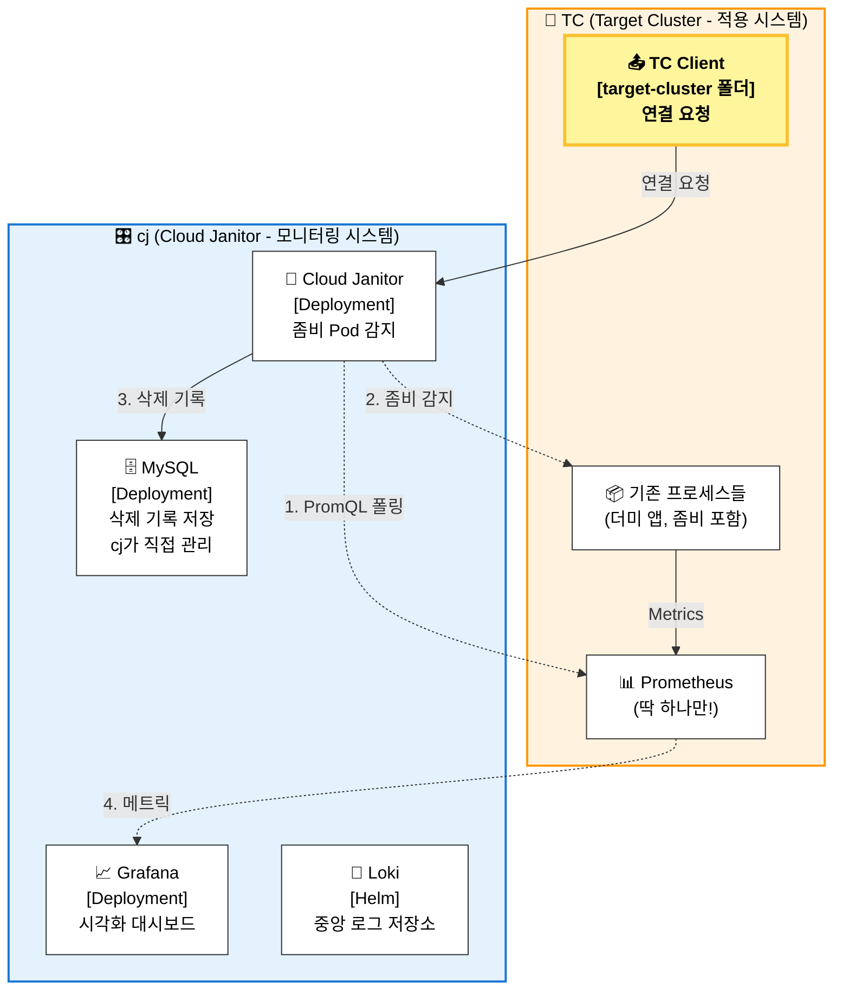

# Cloud Janitor

KT Cloud Tech Up 2기 클라우드 인프라 과정 기본 프로젝트 2조(내 이름은 코난, 탐정 2조)

**Zombie Pod 감지 및 자동 정리 시스템**

## Team Members
- 신봉근 : 팀장, 인프라
- 문경호 : 부팀장, 인프라
- 이우열 : 서기, 백엔드
- 김건 : 백엔드
- 조승연 : 시각화

## Index
1. [🏗️ Project Architecture](#🏗️-project-architecture)
2. [🛠 Tech Stack](#🛠-tech-stack)
3. [🚀 Quick Start](#🚀-quick-start)
4. [🛠️ cj CLI 명령어 가이드](#🛠️-cj-cli-명령어-가이드)

## 🏗️ Project Architecture

Cloud Janitor는 **TC(Target Cluster, 적용 시스템)**와 **cj(Cloud Janitor, 모니터링 시스템)**로 분리된 아키텍처입니다.



### 핵심 설계 원칙

1. **TC (적용 시스템)**: Prometheus만 존재, 기존 프로세스들 유지
2. **cj (모니터링 시스템)**: MySQL 있음, 좀비 감지 및 삭제 로그 관리
3. **연결 요청 (TC → cj)**: TC가 능동적으로 cj에 연결 요청 전송 (target-cluster 폴더)
4. **모니터링 (cj → TC)**: cj가 TC의 Prometheus API를 폴링하고 Docker API 호출
5. **데이터 소스 분리**: cj MySQL에 삭제 기록, TC Prometheus에 메트릭

### 연결 방식

TC에서 Prometheus와 앱을 실행하고, cj에서 설정/시작하여 연결합니다.

## 🛠 Tech Stack

| Category | Technology | Version | Description |
|----------|------------|---------|-------------|
| Language | Python | 3.12.12 | Main programming language |
| Package Manager | uv | latest | Fast Python package installer & resolver |
| IaC | Terraform | 1.14.4 | Infrastructure as Code |
| IaC | Ansible | 2.20.2 | Configuration Management |
| Container | Docker | latest | Container Runtime |
| Container | Kind | TBA | Kubernetes in Docker |
| Container Orchestration | Kubernetes (kubectl) | | Container Orchestration |
| Package Manager | Helm | | Kubernetes Package Manager |
| Database | MySQL | | Relational Database |
| Monitoring | Prometheus | | Metrics Collection |
| Visualization | Grafana | | Data Visualization |
| Logging | Loki | | Log Aggregation System |

버전 관리는 `pyproject.toml` 및 본 표를 기준으로 합니다.

## 🚀 Quick Start

### 사전 요구사항

- Docker & Docker Compose
- Terraform >= 1.14.4
- Ansible >= 2.20.2
- kubectl
- Helm
- **target-cluster 앱과 Prometheus는 별도 실행**

### 실행 프로세스

```bash
# 1) CLI 설치
./cj install
./tc install

# 2) 초기화
cj init

# 3) TC 앱 시작
tc start

# 4) TC Prometheus + Promtail 시작
tc pm start

# 5) cj 설정 및 시작
cj setup
cj start

# 6) TC → cj 연결
tc connect -a localhost
```
Prometheus가 먼저 실행되어 있어야 `cj setup`이 정상 동작합니다.

## 🛠️ cj CLI 명령어 가이드

Cloud Janitor CLI(`cj`)는 tc에 연결하여 모니터링하는 프로젝트를 쉽게 관리할 수 있는 도구입니다.

### 설치

```bash
# cj CLI 시스템 PATH에 등록
./cj install

# 설치 과정:
# 1. 쉘 타입 자동 감지 (zsh, bash)
# 2. .zshrc 또는 .bashrc에 CJ_HOME과 PATH 추가
# 3. .zprofile에도 CJ_HOME과 PATH 추가 (login shell용)
# 4. 시스템 PATH에 심볼릭 링크 생성 시도
```

### 프로젝트 관리

```bash
cj init              # 프로젝트 초기화
cj setup             # 전체 설정 (Target Prometheus 확인 + Mgmt Cluster 생성)
cj start             # 서비스 시작
cj stop              # 서비스 중지
cj status            # 전체 시스템 상태 확인
```

### Terraform (Management Cluster)

```bash
cj tf init           # Terraform 초기화
cj tf plan           # Terraform 계획 확인
cj tf apply          # Terraform 적용 (클러스터 생성)
cj tf destroy        # Terraform 삭제 (클러스터 삭제)
cj tf output         # Terraform 출력값 확인
cj tf shell          # Terraform 쉘 실행
```

### Ansible (Target Prometheus 확인)

```bash
cj ans install       # Target Prometheus 접속 확인
cj ans configure     # Prometheus 설정 및 Grafana 연동
cj ans shell         # Ansible playbook 실행 쉘
```

### 상태 및 로그

```bash
cj status            # 전체 상태 확인
cj logs janitor      # Cloud Janitor 로그
cj logs mysql        # MySQL 로그
cj logs grafana      # Grafana 로그
cj logs loki         # Loki 로그
```

### 접속

```bash
cj grafana           # Grafana 접속 (브라우저 열기)
```

### 기타

```bash
cj env               # .env 파일 편집
cj kubeconfig        # kubeconfig 경로 출력
cj shell             # Cloud Janitor 프로젝트 디렉토리로 이동
cj version           # 버전 정보
cj help              # 도움말
```

### 환경 변수

- `CJ_HOME`: Cloud Janitor 프로젝트 경로 (기본값: cj 스크립트 위치)
- `TARGET_HOST`: Target 서버 주소 (기본값: localhost, .env 파일에서 설정)

```bash
# 예: 다른 디렉토리에서 cj 사용
export CJ_HOME="/home/user/Cloud_Janitor"
export TARGET_HOST="192.168.1.100"
cd /any/where
cj status
```

## 📊 Monitoring & Visualization

### Grafana 대시보드

Cloud Janitor는 다음 3개의 주요 대시보드를 제공합니다:

1. **Target Cluster Metrics**
   - 컨테이너 CPU/메모리/네트워크 사용량
   - 리소스 사용 현황
   - **Monitoring Service**와 통신

2. **Cloud Janitor Deletion Logs**
   - 삭제된 파드 이력
   - 삭제 사유 분석
   - 비용 절감 효과

3. **System Health**
   - Cloud Janitor Pod 상태
   - MySQL 연결 상태
   - Prometheus 연결 상태

### PromQL 쿼리 예시

Cloud Janitor에서 사용하는 PromQL 쿼리:

```promql
# CPU 사용량이 낮은 컨테이너 감지 (2분 평균 10m 미만)
rate(container_cpu_usage_seconds_total{name!=""}[2m]) < 0.01

# 네트워크 수신량이 낮은 컨테이너 감지 (2분 평균 100바이트 미만)
rate(container_network_receive_bytes_total{name!=""}[2m]) < 100

# 메모리 사용량이 낮은 컨테이너 감지
container_memory_usage_bytes{name!=""} < 1048576  # 1MB 미만

# 특정 라벨이 있는 좀비 컨테이너 감지
rate(container_cpu_usage_seconds_total{label_zombie_type="idle"}[2m]) < 0.01
```

### 데이터 소스 설정

Grafana에 Target Prometheus 데이터소스를 추가하려면:

1. Grafana 접속 (http://localhost:3000)
2. Configuration → Data Sources → Add data source
3. Prometheus 선택
4. URL: `http://TARGET_HOST:9091` (기본: http://localhost:9091)
5. Save & Test

## 🧪 Testing

### 좀비 파드 테스트

Target Cluster에는 테스트용 좀비 파드들이 미리 배포되어 있습니다:

```bash
# 실행 중인 컨테이너 확인
docker ps --filter "network=tc-network"

# 좀비 컨테이너 확인
docker ps --filter "label=app-type=zombie"

# 좀비 컨테이너 로그 확인
docker logs app-zombie-sleeper
docker logs app-zombie-completed
docker logs app-zombie-test
docker logs app-zombie-dev
```

### 좀비 파드 삭제 테스트

```bash
# .env에서 DRY_RUN을 False로 설정 (실제 삭제)
vim .env
# DRY_RUN=False

# cj start로 서비스 시작
cj start

# cj logs로 로그 확인
cj logs janitor

# 삭제 로그 확인 (MySQL)
kubectl exec -it mysql -n default -- mysql -uroot -prootpassword cloud_janitor -e "SELECT * FROM deletion_logs ORDER BY deleted_at DESC LIMIT 10;"

# 삭제된 컨테이너 확인
docker ps -a --filter "label=app-type=zombie" | grep Exited
```

### 트러블슈팅

**문제**: Cloud Janitor가 좀비 파드를 감지하지 못함
- **해결**: 
  ```bash
  # Target Prometheus 접속 확인
  curl http://localhost:9091/-/healthy
  
  # PromQL 쿼리 테스트
  curl -X POST http://localhost:9091/api/v1/query -d 'query=rate(container_cpu_usage_seconds_total{name!=""}[2m]) < 0.01'
  
  # Cloud Janitor 로그 확인
  cj logs janitor
  ```

**문제**: 컨테이너 삭제가 실패함
- **해결**:
  ```bash
  # Docker Socket 접근 권한 확인
  kubectl exec -it cloud-janitor -n default -- ls -la /var/run/docker.sock
  
  # 권한 설정 확인
  kubectl get pod cloud-janitor -n default -o yaml | grep -A 10 volumeMounts
  ```

**문제**: Target Prometheus에 연결할 수 없음
- **해결**:
  ```bash
  # TARGET_HOST 확인
  cj env
  # TARGET_HOST=192.168.1.100 (실제 target 서버 IP)
  
  # Target Prometheus 접속 확인
  curl http://192.168.1.100:9091/-/healthy
  
# Target Prometheus 시작
tc prometheus start
  ```
