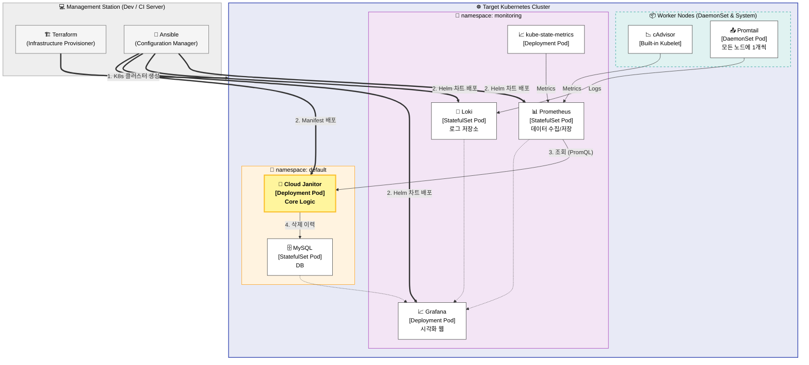
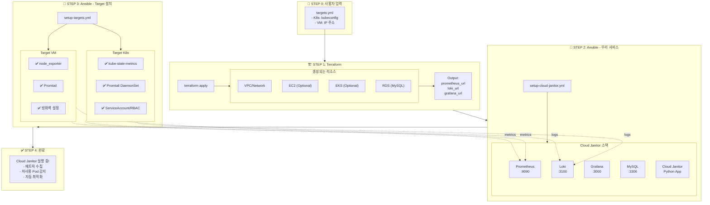

# Cloud Janitor

KT Cloud Tech Up 2기 클라우드 인프라 과정 기본 프로젝트 2조(내 이름은 코난, 탐정 2조)

## Team Members
- 신봉근 : 팀장, 인프라
- 문경호 : 부팀장, 인프라
- 이우열 : 서기, 백엔드
- 김건 : 백엔드
- 조승연 : 시각화

## Index
1. [🏗️ Project Architecture](#🏗️-project-architecture)
2. [🛠 Tech Stack](#🛠-tech-stack)
3. [🔄 Workflow](#🔄-workflow)

## 🏗️ Project Architecture

## 🛠 Tech Stack

| Category | Technology | Version | Description |
|----------|------------|---------|-------------|
| Language | Python | 3.12.12 | Main programming language |
| Package Manager | uv | latest | Fast Python package installer & resolver |
| IaC | Terraform | 1.14.3 | Infrastructure as Code |
| IaC | Ansible | 2.20.2 | Configuration Management |
| Container | Docker | latest | Container Runtime |
| Container | Kind | TBA | Kubernetes in Docker |
| Container Orchestration | Kubernetes (kubectl) | | Container Orchestration |
| Package Manager | Helm | | Kubernetes Package Manager |
| Database | MySQL | | Relational Database |
| Monitoring | Prometheus | | Metrics Collection |
| Visualization | Grafana | | Data Visualization |
| Logging | Loki | | Log Aggregation System |

버전 관리는 `pyproject.toml` 및 본 표를 기준으로 합니다.

## 🔄 Workflow

