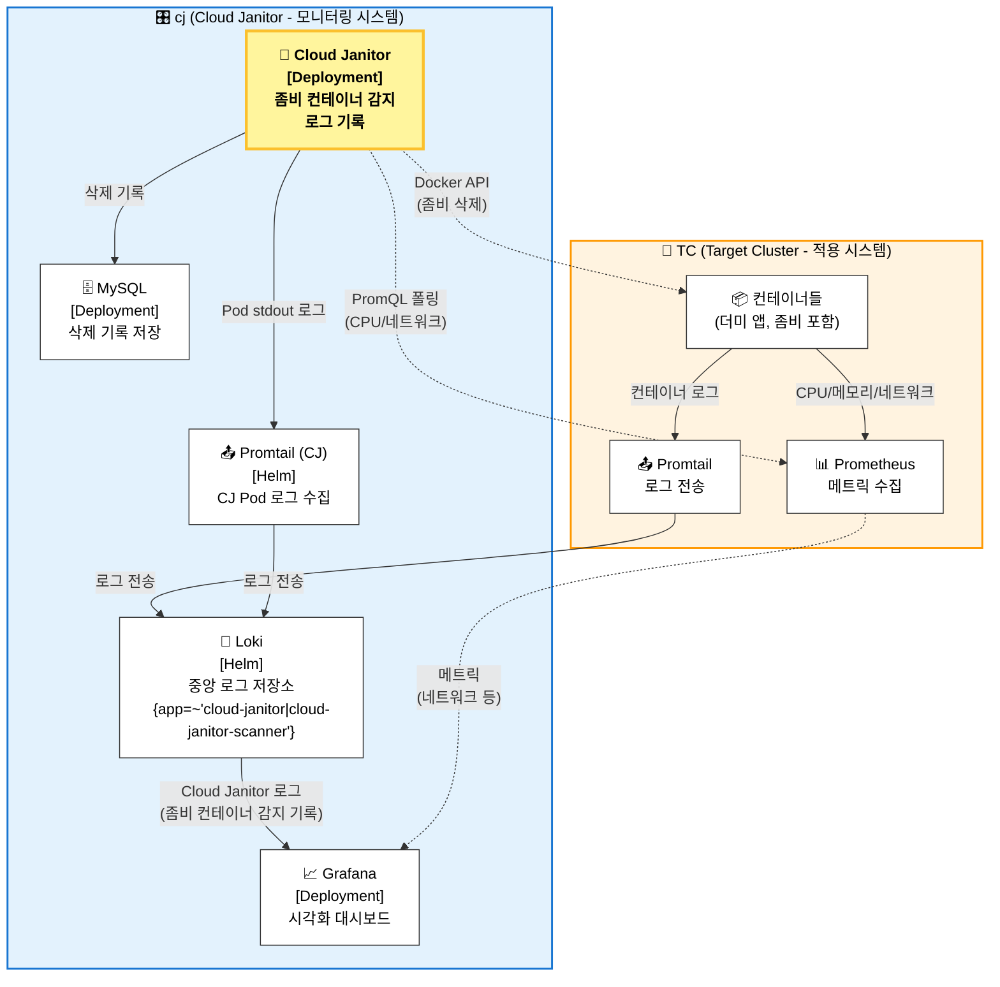
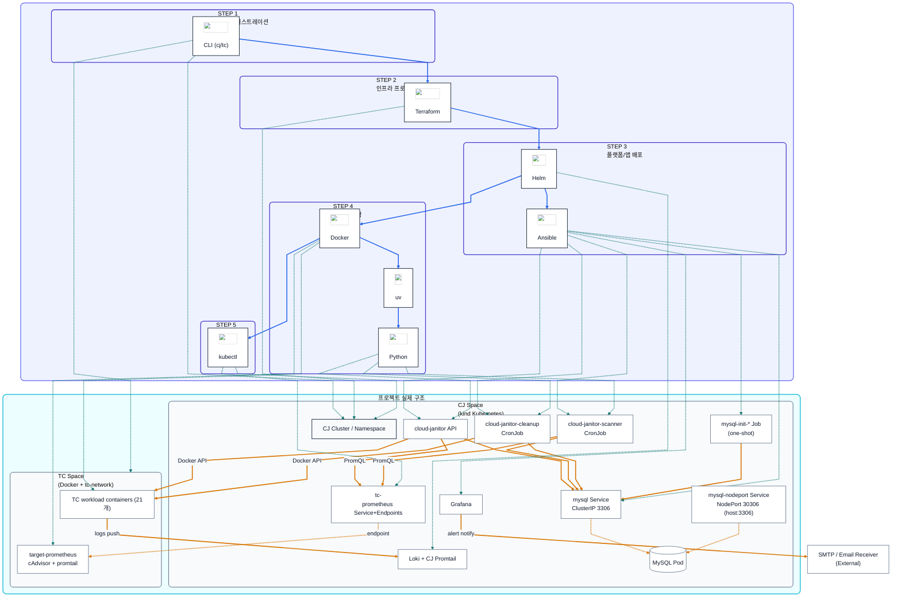

# Cloud Janitor

KT Cloud Tech Up 2기 클라우드 인프라 과정 기본 프로젝트 2조(내 이름은 코난, 탐정 2조)

**Zombie Container 감지 및 자동 정리 시스템**

## 아키텍처 R&R

### TC (Target Cluster - 적용 시스템)
- **Prometheus**: 컨테이너 메트릭 수집
  - cAdvisor를 통해 Docker 컨테이너 메트릭(CPU, 메모리, 네트워크) 수집
  - Cloud Janitor가 PromQL 쿼리로 폴링하여 좀비 컨테이너 감지
- **Promtail**: TC 컨테이너 로그 수집
  - TC의 모든 컨테이너 로그를 CJ의 Loki로 전송
  - 로그 라벨: `{job="tc-docker"}`

### CJ (Cloud Janitor - 모니터링 시스템)
- **Loki**: 중앙 로그 저장소
  - TC Promtail 로그 수신 (TC 컨테이너 로그)
  - CJ Promtail 로그 수신 (Cloud Janitor/Scanner/Cleanup 활동 로그)
- **Promtail (CJ)**: CJ Pod 로그 수집
  - `cloud-janitor`, `cloud-janitor-scanner`, `cloud-janitor-cleanup` 로그를 Loki로 전송
- **Grafana**: 데이터 시각화
  - Loki 로그 기반 대시보드 (좀비 컨테이너 감지 기록)
  - Prometheus 메트릭 기반 대시보드 (네트워크 트래픽 등)
- **Cloud Janitor**: 좀비 컨테이너 감지 및 삭제 서비스
  - TC Prometheus 폴링 → 좀비 컨테이너 감지 → 삭제 → 로그 기록
  - 감지 결과를 로그로 남겨 Loki에 저장
- **MySQL**: 좀비 컨테이너 삭제 기록 DB

## Team Members
- 신봉근 : 팀장, 인프라
- 문경호 : 부팀장, 인프라
- 이우열 : 서기, 백엔드
- 김건 : 백엔드
- 조승연 : 시각화

## Index
1. [🏗️ Project Architecture](#🏗️-project-architecture)
2. [🛠 Tech Stack](#🛠-tech-stack)
3. [🚀 Quick Start](#🚀-quick-start)
4. [⌨️ CLI 명령어 문서](#⌨️-cli-명령어-문서)
5. [🌐 네트워크 인프라 문서](#🌐-네트워크-인프라-문서)
6. [📊 운영 확인 가이드](#📊-운영-확인-가이드)

## 🏗️ Project Architecture

Cloud Janitor는 **TC(Target Cluster, 적용 시스템)**와 **CJ(Cloud Janitor, 모니터링 시스템)**로 분리된 아키텍처입니다.


```mermaid
flowchart TB
    %% 스타일 정의
    classDef default fill:#ffffff,stroke:#333333,stroke-width:1px,color:#000000;
    classDef highlight fill:#fff59d,stroke:#fbc02d,stroke-width:3px,color:#000000,font-weight:bold;
    classDef tc fill:#fff3e0,stroke:#ff9800,stroke-width:2px,color:#000000;
    classDef cj fill:#e3f2fd,stroke:#1976d2,stroke-width:2px,color:#000000;

    %% TC (적용 시스템)
    subgraph TC_Cluster["🎯 TC (Target Cluster - 적용 시스템)"]
        direction TB
        style TC_Cluster fill:#fff3e0,stroke:#ff9800,stroke-width:2px,color:#000000

        TC_Prometheus["📊 Prometheus<br/>메트릭 수집"]
        TC_Promtail["📤 Promtail<br/>로그 전송"]
        TC_Apps["📦 컨테이너들<br/>(더미 앱, 좀비 포함)"]
    end

    %% cj (모니터링 시스템)
    subgraph CJ_Cluster["🎛️ cj (Cloud Janitor - 모니터링 시스템)"]
        direction TB
        style CJ_Cluster fill:#e3f2fd,stroke:#1976d2,stroke-width:2px,color:#000000

        CJ_Janitor["🐍 Cloud Janitor<br/>[Deployment]<br/>좀비 컨테이너 감지<br/>로그 기록"]:::highlight
        CJ_Promtail["📤 Promtail (CJ)<br/>[Helm]<br/>CJ Pod 로그 수집"]
        CJ_Loki["📝 Loki<br/>[Helm]<br/>중앙 로그 저장소<br/>{app=~'cloud-janitor|cloud-janitor-scanner'}"]
        CJ_MySQL["🗄️ MySQL<br/>[Deployment]<br/>삭제 기록 저장"]
        CJ_Grafana["📈 Grafana<br/>[Deployment]<br/>시각화 대시보드"]
    end

    %% 데이터 흐름 - TC 내부
    TC_Apps -->|"CPU/메모리/네트워크"| TC_Prometheus
    TC_Apps -->|"컨테이너 로그"| TC_Promtail

    %% TC → cj 연결
    TC_Promtail -->|"로그 전송"| CJ_Loki
    
    CJ_Janitor -.->|"PromQL 폴링<br/>(CPU/네트워크)"| TC_Prometheus
    CJ_Janitor -.->|"Docker API<br/>(좀비 삭제)"| TC_Apps

    %% cj 내부 데이터 흐름
    CJ_Janitor -->|"Pod stdout 로그"| CJ_Promtail
    CJ_Promtail -->|"로그 전송"| CJ_Loki
    CJ_Janitor -->|"삭제 기록"| CJ_MySQL

    %% 데이터 소스
    CJ_Loki -->|"Cloud Janitor 로그<br/>(좀비 컨테이너 감지 기록)"| CJ_Grafana
    
    TC_Prometheus -.->|"메트릭<br/>(네트워크 등)"| CJ_Grafana
```

### 핵심 설계 원칙

1. **TC (적용 시스템)**: Prometheus + Promtail (메트릭/로그 수집)
2. **CJ (모니터링 시스템)**: Promtail(CJ 로그 수집), Loki (로그 저장), Grafana (시각화), Cloud Janitor (감지/삭제), MySQL (기록 저장)
3. **데이터 흐름**: 
   - TC Prometheus → Cloud Janitor 폴링 → 좀비 컨테이너 감지
   - TC Promtail → CJ Loki (TC 컨테이너 로그)
   - Cloud Janitor/Scanner/Cleanup 로그 → CJ Promtail → CJ Loki
   - Cloud Janitor 로그 → Grafana 대시보드 (좀비 감지/삭제 기록)
   - TC Prometheus → Grafana 대시보드 (네트워크 트래픽 등)
4. **연결 방식**: TC Promtail과 CJ Promtail이 각각 Loki로 로그를 전송, Cloud Janitor가 TC Prometheus를 폴링

### 연결 방식

TC에서 Prometheus와 앱을 실행하고, cj에서 설정/시작하여 연결합니다.

### Janitor 로그 소스 구분

| app 라벨 | 실행 주체 | 용도 |
|----------|-----------|------|
| `cloud-janitor` | Deployment (API 서버) | 등록 API, 수동 스캔 실행 로그, 서비스 상태 로그 |
| `cloud-janitor-scanner` | CronJob (주기 스캔) | 자동 주기 스캔 결과 로그 (`SCAN_CYCLE_*`, `SCAN_CONTAINER`) |
| `cloud-janitor-cleanup` | CronJob (주기 정리) | 유예기간 만료 대상 정리 로그 (`CLEANUP_*`) |

### 확장 네트워크 토폴로지 (3.3)

아래 다이어그램은 실제 런타임 서비스와 도구 적용 지점을 함께 표현한 확장 구조입니다.


```mermaid
%%{init: {"theme":"base","flowchart":{"curve":"linear","nodeSpacing":20,"rankSpacing":38},"themeVariables":{"lineColor":"#2563eb","edgeLabelBackground":"#f8fafc"}} }%%
flowchart TB
    classDef stack fill:#ffffff,stroke:#1f2937,color:#0f172a,stroke-width:1.5px;
    classDef area fill:#f8fafc,stroke:#334155,color:#0f172a,stroke-width:1.7px;
    classDef svc fill:#ffffff,stroke:#64748b,color:#0f172a,stroke-width:1.3px;

    subgraph STAGES [" "]
        direction LR

        subgraph STEP1 ["STEP 1<br/>실행 오케스트레이션<br/>"]
            direction TB
            CLI["<img src='https://cdn.simpleicons.org/gnubash/4EAA25' style='width:30px; height:30px;' /><br/>CLI (cj/tc)"]:::stack
        end

        subgraph STEP2 ["STEP 2<br/>인프라 프로비저닝<br/>"]
            direction TB
            TF["<img src='https://cdn.simpleicons.org/terraform/7B42BC' style='width:30px; height:30px;' /><br/>Terraform"]:::stack
        end

        subgraph STEP3 ["STEP 3<br/>플랫폼/앱 배포<br/>"]
            direction TB
            HELM["<img src='https://cdn.simpleicons.org/helm/0F1689' style='width:30px; height:30px;' /><br/>Helm"]:::stack
            ANS["<img src='https://cdn.simpleicons.org/ansible/EE0000' style='width:30px; height:30px;' /><br/>Ansible"]:::stack
            HELM --> ANS
        end

        subgraph STEP4 ["STEP 4<br/>런타임 실행<br/>"]
            direction TB
            DK["<img src='https://cdn.simpleicons.org/docker/2496ED' style='width:30px; height:30px;' /><br/>Docker"]:::stack
            UV["<img src='https://cdn.simpleicons.org/pypi/3776AB' style='width:30px; height:30px;' /><br/>uv"]:::stack
            PY["<img src='https://cdn.simpleicons.org/python/3776AB' style='width:30px; height:30px;' /><br/>Python"]:::stack
            DK --> UV --> PY
        end

        subgraph STEP5 ["STEP 5<br/>운영 제어<br/>"]
            direction TB
            KCTL["<img src='https://cdn.simpleicons.org/kubernetes/326CE5' style='width:30px; height:30px;' /><br/>kubectl"]:::stack
        end
    end

    %% 단계 흐름
    CLI --> TF --> HELM --> DK --> KCTL

    subgraph RUNTIME ["프로젝트 실제 구조"]
        direction LR

        subgraph CJSPACE ["CJ Space<br>(kind Kubernetes)"]
            direction TB
            subgraph CJR1[" "]
                direction LR
                CJCORE["CJ Cluster / Namespace"]:::area
                CJA["cloud-janitor API"]:::svc
                CJSCAN["cloud-janitor-scanner<br/>CronJob"]:::svc
                CJCLEAN["cloud-janitor-cleanup<br/>CronJob"]:::svc
            end
            subgraph CJR2[" "]
                direction LR
                CJL["Loki + CJ Promtail"]:::svc
                CJG["Grafana"]:::svc
                CJT["tc-<name><br/>prometheus Service+Endpoints"]:::svc
            end
            CJDDB[("MySQL Pod")]:::svc
            CJDSVC["mysql Service<br/>ClusterIP 3306"]:::svc
            CJDNP["mysql-nodeport Service<br/>NodePort 30306 (host:3306)"]:::svc
            CJDINIT["mysql-init-* Job<br/>(one-shot)"]:::svc
        end

        subgraph TCSPACE ["TC Space<br>(Docker + tc-network)"]
            direction TB
            TCA["TC workload containers (21개)"]:::svc
            TCP["target-prometheus<br/>cAdvisor + promtail"]:::svc
        end
    end
    EMAIL["SMTP / Email Receiver<br/>(External)"]:::svc

    %% 서비스 내부 흐름
    CJA -->|"PromQL"| CJT
    CJSCAN -->|"PromQL"| CJT
    CJT -.->|"endpoint"| TCP
    TCA -->|"logs push"| CJL
    CJA -->|"Docker API"| TCA
    CJCLEAN -->|"Docker API"| TCA
    CJA --> CJDSVC
    CJSCAN --> CJDSVC
    CJCLEAN --> CJDSVC
    CJDINIT --> CJDSVC
    CJDSVC -.-> CJDDB
    CJDNP -.-> CJDDB
    CJG -->|"alert notify"| EMAIL

    %% 기술 스택 -> 적용 대상 (pointing)
    CLI -.-> CJCORE
    CLI -.-> TCSPACE
    TF -.-> CJCORE
    HELM -.-> CJL
    ANS -.-> CJA
    ANS -.-> CJSCAN
    ANS -.-> CJCLEAN
    ANS -.-> CJG
    ANS -.-> CJDSVC
    ANS -.-> CJDINIT
    DK -.-> TCA
    DK -.-> TCP
    PY -.-> CJA
    PY -.-> CJSCAN
    PY -.-> CJCLEAN
    KCTL -.-> CJCORE
    KCTL -.-> CJT

    style RUNTIME fill:#ecfeff,stroke:#06b6d4,stroke-width:2px,rx:10,ry:10
    style CJSPACE fill:#f8fafc,stroke:#64748b,stroke-width:1.6px,rx:8,ry:8
    style TCSPACE fill:#f8fafc,stroke:#64748b,stroke-width:1.6px,rx:8,ry:8
    style STAGES fill:#eef2ff,stroke:#6366f1,stroke-width:2px,rx:10,ry:10
    style STEP1 fill:#eef2ff,stroke:#4338ca,stroke-width:2px,rx:8,ry:8
    style STEP2 fill:#eef2ff,stroke:#4338ca,stroke-width:2px,rx:8,ry:8
    style STEP3 fill:#eef2ff,stroke:#4338ca,stroke-width:2px,rx:8,ry:8
    style STEP4 fill:#eef2ff,stroke:#4338ca,stroke-width:2px,rx:8,ry:8
    style STEP5 fill:#eef2ff,stroke:#4338ca,stroke-width:2px,rx:8,ry:8
    style CJR1 fill:transparent,stroke:transparent
    style CJR2 fill:transparent,stroke:transparent
    %% 화살표 색상 구분
    %% 0~6: 단계 실행 흐름
    %% 7~19: 서비스 내부 데이터 흐름
    %% 20~36: 도구 -> 적용 대상(pointing)
    linkStyle 0,1,2,3,4,5,6 stroke:#2563eb,stroke-width:2.4px,color:#0f172a,opacity:1
    linkStyle 7,8,9,10,11,12,13,14,15,16,17,18,19 stroke:#d97706,stroke-width:2.6px,color:#0f172a,opacity:1
    linkStyle 20,21,22,23,24,25,26,27,28,29,30,31,32,33,34,35,36 stroke:#0f766e,stroke-width:2px,color:#0f172a,opacity:1
```

| 현재(로컬) | CSP에서 대응되는 형태 |
|---|---|
| kind 단일 노드 + NodePort | Managed Kubernetes + Ingress/LoadBalancer |
| Docker bridge(`tc-network`) | VPC/Subnet 내 워크로드 네트워크 |
| `host.docker.internal`/host 포트 | 내부 LB 주소, Private Endpoint, NAT 경유 주소 |
| 로컬 Docker 소켓 제어 | CSP 정책에 맞는 런타임 제어 경로(대개 K8s API 기반) |

## 🛠 Tech Stack

| Category | Technology | Version | Description |
|----------|------------|---------|-------------|
| Language | Python | 3.12 (`.python-version`) | Application runtime |
| Package Manager | uv | 0.9.27 | Python dependency/environment management |
| IaC | Terraform CLI | 1.14.3 | kind 클러스터 및 인프라 프로비저닝 |
| IaC | Terraform Providers | kind `~> 0.2.0`, kubernetes `~> 2.0`, helm `~> 2.0` | IaC 실행 provider |
| Config Management | Ansible Core | 2.20.2 | 앱/설정 배포 자동화 |
| Container Runtime | Docker Engine | 29.1.2 | TC/CJ 컨테이너 실행 기반 |
| Container Runtime | Docker Compose | 2.40.3 | Compose 기반 서비스 실행 |
| Orchestration | kind | 0.31.0 | Kubernetes in Docker |
| Orchestration | kubectl | 1.35.0 | Kubernetes 운영 제어 |
| Package Manager | Helm | 4.1.0 | Kubernetes 패키징/배포 |
| Database | MySQL | 8.0 | 삭제/스캔 이력 저장 |
| Metrics | Prometheus (TC) | `prom/prometheus:latest` | 컨테이너 메트릭 수집 |
| Metrics Exporter | cAdvisor | `gcr.io/cadvisor/cadvisor:latest` | Docker 메트릭 exporter |
| Logging Agent | Promtail (TC) | `grafana/promtail:3.0.0` | TC 로그 수집/전송 |
| Logging | Loki (CJ) | chart `2.9.11`, image `2.9.10` | 중앙 로그 저장소 |
| Visualization | Grafana (CJ) | `grafana/grafana:10.4.3` | 대시보드/알림 시각화 |

도구 버전(uv/terraform/ansible/docker/kubectl/helm/kind)은 2026-02-27 로컬 검증 기준이며, 앱/인프라 버전은 코드(`pyproject.toml`, Terraform, Ansible, Compose) 기준입니다.

## 🚀 Quick Start

### 사전 요구사항

- Docker Engine 29.1.2+
- Docker Compose 2.40.3+
- Terraform 1.14.3+ (최소 요구: 1.0.0)
- uv 0.9.27+
- kubectl 1.35.0+
- Helm 4.1.0+
- kind 0.31.0+
- **target-cluster 앱과 Prometheus는 별도 실행**

### TC CLI 위치

- TC CLI 본체: `target-cluster/tc`
- 루트 `tc`는 `target-cluster/tc`를 호출하는 래퍼입니다.
- 설치는 기존처럼 `./tc install` 또는 `target-cluster/tc install` 둘 다 가능합니다.

### 실행 프로세스

```bash
# 1. CLI 설치 (선택사항, 이미 설치되어 있으면 생략)
./cj install
./tc install

# ========================================
# 🛠️ 수동 실행
# ========================================
# PATH가 아직 반영되지 않았다면 cj/tc 대신 ./cj ./tc로 실행

# 2. 초기화
./cj init

# 3. TC 앱 시작
./tc start

# 4. TC Prometheus + Promtail 시작
./tc pm start

# 5. cj 설정 (Grafana/Loki/MySQL 준비)
./cj setup

# 6. cj 서비스 시작
./cj start

# 7. TC → cj 연결 요청
./tc connect -a localhost

# (선택) TC에서 화이트리스트 직접 설정
#  - base(고정): target-cluster/.env 의 CJ_CONTAINER_WHITELIST
#    (whitelist 명령으로 수정되지 않음)
#  - custom(사용자): ./tc whitelist set/add/remove/pick
#    (target-cluster/.whitelist.custom 에 저장)
#  - 전송 방식: ./tc connect 시 base+custom을 합쳐 labels.container_whitelist로 동봉 전송
#  - 실시간 반영: ./tc whitelist ... -a localhost -n tc-target
```

## ⌨️ CLI 명령어 문서

- CJ CLI 문서: [`docs/cj-cli.md`](docs/cj-cli.md)
- TC CLI 문서: [`docs/tc-cli.md`](docs/tc-cli.md)

각 문서는 실제 `./cj help`, `./tc help`, `./target-cluster/setup-connection-to-cj.sh --help`, `./target-cluster/whitelist.sh --help` 기준으로 정리되어 있습니다.

## 🌐 네트워크 인프라 문서

- 네트워크 인프라 관점 가이드: [`docs/network-infrastructure-cj-tc.md`](docs/network-infrastructure-cj-tc.md)
- CJ/TC 분리 아키텍처, 네트워크 토폴로지, 포트/프로토콜, 자동 연결 시퀀스를 중점 설명합니다.
- 외부 TC 서버(SSH 터널/역터널) 가이드: [`docs/external-tc-server-scenarios.md`](docs/external-tc-server-scenarios.md)

## 📊 운영 확인 가이드

### 빠른 점검 순서

```bash
# 1) TC/CJ 상태
tc status
cj status

# 2) TC -> CJ 연결 상태 점검
tc connect --check -a localhost

# 3) 수동 1회 스캔
cj scan

# 4) 로그 확인
cj logs janitor
tc logs promtail
```
