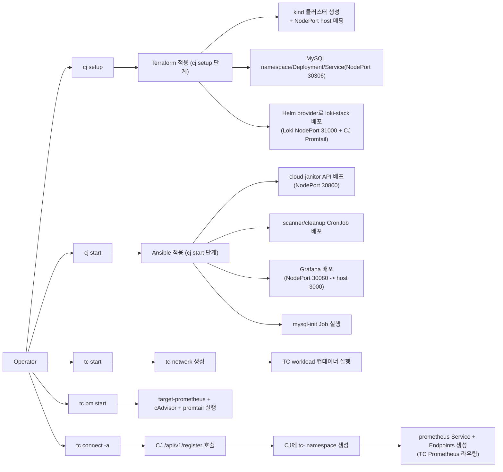

# Cloud Janitor 네트워크 인프라 동작 문서

이 문서는 **인프라가 실제로 어떤 순서로 올라오고**, 이후 **네트워크가 어떻게 동작하는지**만 설명합니다.

---

## 1. 인프라 실행 순서 (Terraform/Ansible 중심)

---

## 2. 네트워크 동작 방식

### 2.1 Metrics Plane

1. TC 컨테이너 메트릭이 `cAdvisor`에서 노출됩니다.  
2. `target-prometheus`가 `cAdvisor:8080`을 스크랩합니다.  
3. `tc connect` 후 CJ는 `tc-<name>` namespace의 `prometheus Service+Endpoints`를 통해 TC Prometheus를 내부 DNS로 조회합니다.  
4. `cloud-janitor`, `cloud-janitor-scanner`, `Grafana`가 이 경로로 PromQL 조회를 수행합니다.

### 2.2 Logs Plane

1. TC `promtail`이 TC 컨테이너 로그를 수집합니다.  
2. TC `promtail`이 `${LOKI_URL}/loki/api/v1/push`로 전송합니다. (`tc connect` 응답으로 `LOKI_URL`이 자동 주입됨)  
3. CJ의 `promtail`은 `cloud-janitor/scanner/cleanup` Pod stdout 로그를 수집해 Loki로 보냅니다.  
4. Grafana는 Loki를 조회해 로그 기반 패널/알림을 구성합니다.

### 2.3 State Plane (운영 상태 저장)

1. `cloud-janitor`, `scanner`가 감지/상태 데이터를 MySQL에 기록합니다.  
2. `zombie_lifecycle`, `scan_latest_*`, `registered_targets` 같은 테이블이 현재 상태와 이력을 유지합니다.  
3. Grafana의 일부 패널/알림은 Loki가 아니라 **MySQL datasource**를 직접 조회합니다.
4. 현재 코드 기준으로 `cleanup`의 자동 삭제 로직은 비활성화되어 있어(`process_cleanup` disabled), cleanup CronJob은 네트워크/DB 변경 작업을 거의 수행하지 않습니다.

---

## 3. 외부 접근 포트 (로컬 기준)

| 대상 | 경로 |
|---|---|
| Cloud Janitor API | `http://localhost:30800` |
| Grafana | `http://localhost:3000` (NodePort 30080 매핑) |
| Loki | `http://localhost:31000` |
| MySQL | `localhost:3306` (NodePort 30306 매핑) |

---

## 4. 핵심 정리

- Terraform: **CJ 실행 공간(kind + 핵심 네트워크 진입점 NodePort + 기본 리소스)**를 만든다.  
- Ansible: **`cj start` 단계에서 운영 서비스(API/CronJob/Grafana/초기화 Job)**를 배치해 실제 동작 경로를 완성한다.  
- `tc connect`: **CJ 내부 라우팅(Service+Endpoints)**을 만들어 TC Prometheus를 클러스터 내부에서 표준 DNS로 조회 가능하게 만든다.  
- 결과적으로 데이터 경로는 `Prometheus(메트릭) / Loki(로그) / MySQL(상태)`로 분리되어 동작한다.
